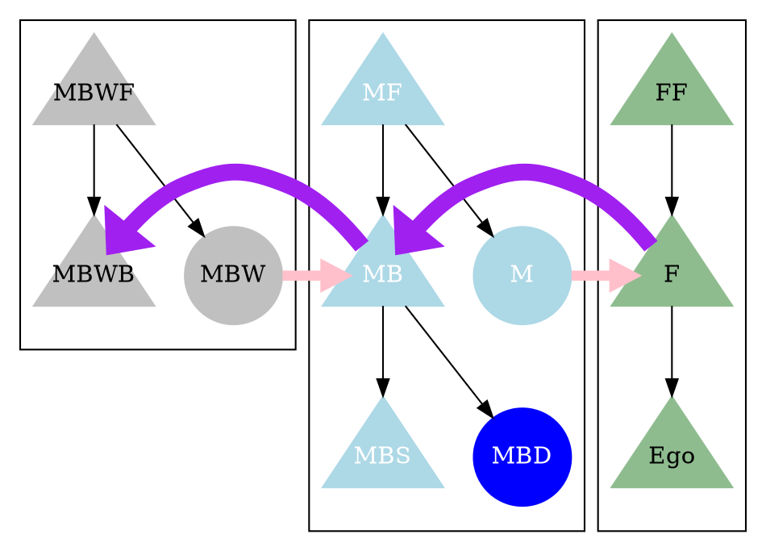

[2020-10-10] **学会発表論文のために graphviz で親族の図を書いていた** 

 11月28日に KAPAL （インドネシア研究会）の
オンライン研究大会がある。
dot で図を書き始めたら、止まらなくなった。

 このプログラムから
以下の図ができる。

 めでたし・めでたし。

- Category: [Program](https://merapano.github.io/categories.html#Program)
- tags: programming dot anthropology paper 
