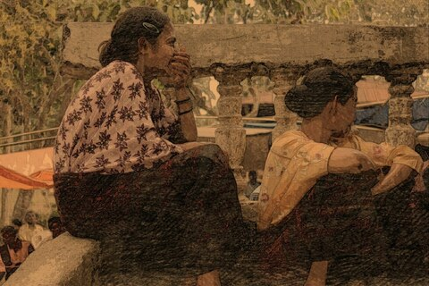
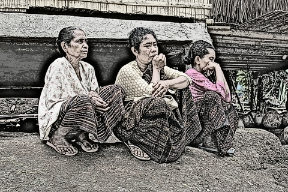
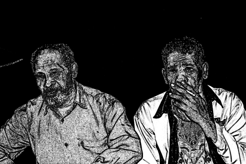
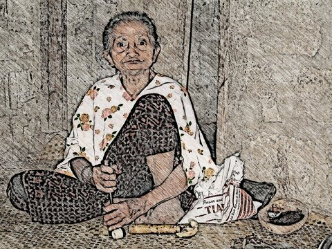
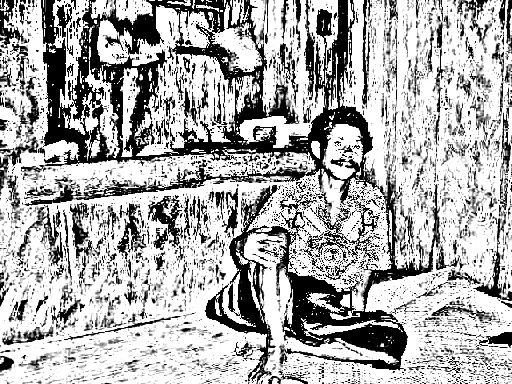

[2021-04-07] **出版のために写真をスケッチ風に加工してみた** 

 フィールドワークの写真を、
出版にそのまま使うことが
難しくなってきた。
そこで、
写真を手描きスケッチ風にするソフトを
使うことを考えた。
使ったソフト［--アンドロイドです--］は
[Sketch Me](https://play.google.com/store/apps/details?id=com.xnview.XnSketch&hl=ja&gl=US) ［--リンクは無料バージョン--］
(Pro) （160円）
と [Pencil Sketch](https://play.google.com/store/apps/details?id=com.dumplingsandwich.pencilsketch&hl=ja&gl=US) だ。
どちらも簡単で、結果もおもしろい。
Sketch Me はすぐに Pro バージョンにした。
じつは Pencil Sketch のほうがいろいろ加工できるのだが、
画面のデザインがぶさいくで、
その上 UI が使いづらいのだ ---
有料バージョンにするのをためらっている。

 とまれ・・・とってもたのしいです。

- Category: [Soft](https://merapano.github.io/categories.html#Soft)
- tags:  sketch android
